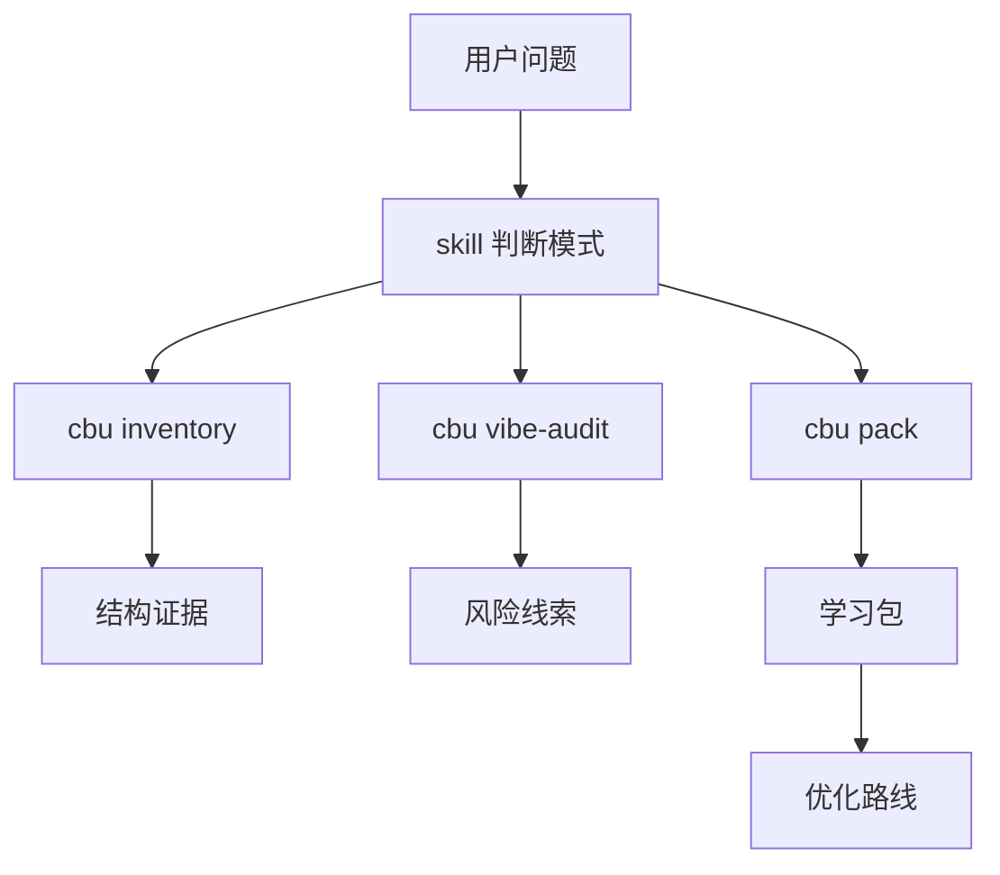
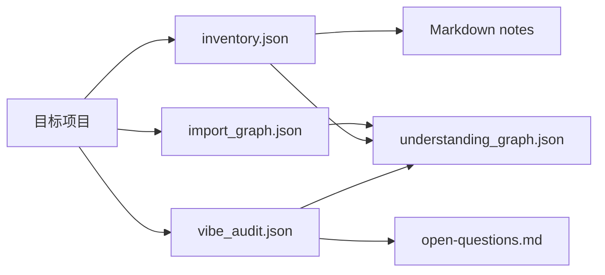

# Diagrams

## Skill + CLI 学习框架

```mermaid
flowchart TD
  User[用户问题] --> Skill[skill 判断模式]
  Skill --> Inventory[cbu inventory]
  Skill --> Audit[cbu vibe-audit]
  Skill --> Pack[cbu pack]
  Inventory --> Evidence[结构证据]
  Audit --> Risks[风险线索]
  Pack --> Notes[学习包]
  Notes --> Improve[优化路线]
```

## 产物管线

```mermaid
flowchart LR
  Target[目标项目] --> Scan[inventory.json]
  Target --> Imports[import_graph.json]
  Target --> Audit[vibe_audit.json]
  Scan --> Markdown[Markdown notes]
  Imports --> Graph[understanding_graph.json]
  Audit --> Questions[open-questions.md]
  Scan --> Graph[understanding_graph.json]
  Audit --> Graph
```
