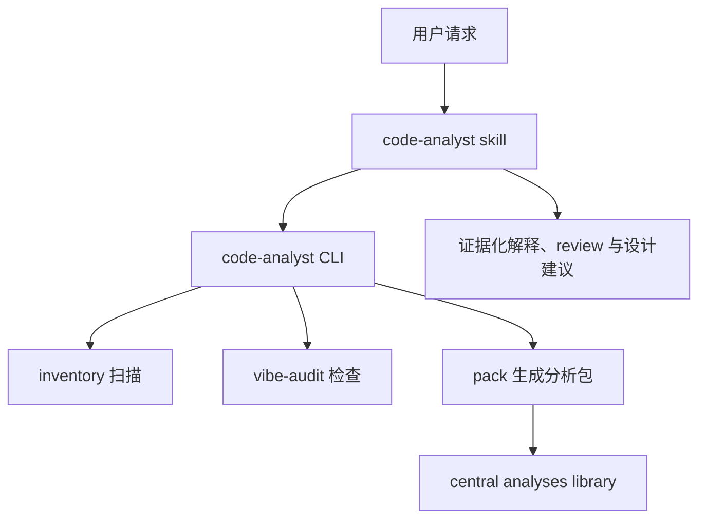
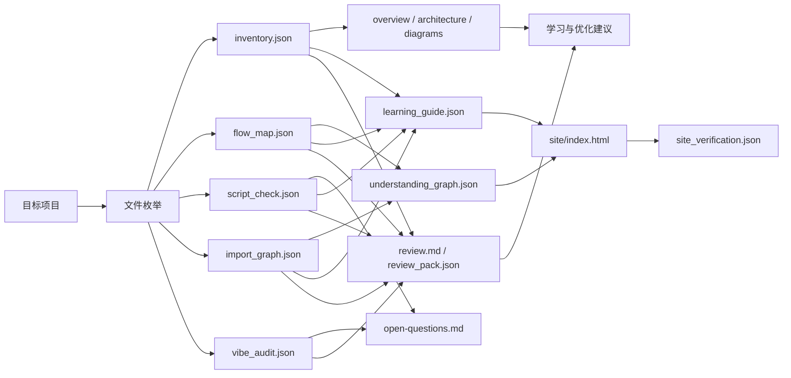

# CodeAnalyst ARCHITECTURE

## 1. Current Shape

当前工作区是 CodeAnalyst 源项目：

```text
/Users/chihoyo/Project/CodeAnalyst/
  README.md
  index.md
  docs/
    SPEC.md
    ARCHITECTURE.md
    ROADMAP.md
    DECISIONS.md
  src/code_analyst/
    cli.py
    flow_map.py
    import_graph.py
    inventory.py
    review_pack.py
    script_check.py
    vibe_audit.py
    pack.py
    render_site.py
    verify_site.py
  skill/
    SKILL.md
    agents/
      openai.yaml
    references/
      quick-learning-framework.md
      output-contract.md
      diagram-recipes.md
  scripts/
    install_cli.sh
    install_remote.sh
    package_release.sh
    sync_skill.sh
    check_install.sh
    update_cli.sh
  tests/
  analyses/
```

全局用户 skill 位于 Codex app 官方 skill discovery 路径：

```text
/Users/chihoyo/.agents/skills/code-analyst/
  SKILL.md
  agents/openai.yaml
  bin/code-analyst
  references/
```

Codex runtime copy 也同步到：

```text
/Users/chihoyo/.codex/skills/code-analyst/
  SKILL.md
  agents/openai.yaml
  bin/code-analyst
  references/
```

`skill/` 是可同步 source-of-truth；两个已安装 skill 目录都是生成副本，不再作为编辑入口。

## 2. Layers



## 3. Module Responsibilities

| Module | Responsibility |
|---|---|
| `cli.py` | argparse command surface, user-facing command dispatch, `sync-skill` delegation, and native `update` dispatch. |
| `flow_map.py` | Project-kind aware entrypoint and flow hint discovery for CLI, service, frontend, Node scripts, and skills. |
| `import_graph.py` | File-level static import graph extraction for Python and JS/TS. |
| `inventory.py` | Deterministic project inventory: files, manifests, entrypoints, types, top directories. |
| `review_pack.py` | Read-only review, refactor direction, and architecture guidance generated from pack evidence. |
| `script_check.py` | Static verification of declared package scripts, bins, and Python entrypoint targets. |
| `vibe_audit.py` | Heuristic checks for vibe-coded leftovers and missing verification signals. |
| `pack.py` | Output-root selection and Markdown/JSON analysis pack generation. |
| `render_site.py` | Static HTML renderer for `understanding_graph.json`; renders reader-first lesson content when `guide` exists, with graph/search as a later Reference Index; no external dependencies. |
| `verify_site.py` | Deterministic validation for generated visual sites before browser inspection. |
| `skill/SKILL.md` | Agent workflow: decide mode, call CLI, explain confirmed facts vs inferences. |
| `scripts/install_cli.sh` | Source checkout install: create `.venv/bin/code-analyst` and remove known legacy global wrappers. |
| `scripts/package_release.sh` | Build native release tarball, checksum, manifest, and installer assets. |
| `scripts/install_remote.sh` | Install GitHub/file release artifacts into the native `~/.local/share/code-analyst` layout. |
| `scripts/update_cli.sh` | Source update lifecycle: install, test, sync, and verify. |

## 3.1 Installed Commands

`scripts/install_cli.sh` installs one project-local source checkout wrapper:

```text
/Users/chihoyo/Project/CodeAnalyst/.venv/bin/code-analyst
```

The wrapper sets `CODE_ANALYST_PROJECT_DIR=/Users/chihoyo/Project/CodeAnalyst`,
sets `PYTHONPATH=/Users/chihoyo/Project/CodeAnalyst/src`, and executes
`python3 -m code_analyst.cli`. It also removes recognized old global
CodeAnalyst wrappers from `/opt/homebrew/bin` when they contain the generated
`python3 -m code_analyst.cli` command.

Native release installs use:

```text
~/.local/share/code-analyst/releases/<version>/
~/.local/share/code-analyst/current
~/.local/bin/code-analyst
```

The native launcher points `CODE_ANALYST_PROJECT_DIR` and `PYTHONPATH` at
`~/.local/share/code-analyst/current`.

### 3.2 Installed Skill Wrapper

`scripts/sync_skill.sh --force` replaces both installed skill copies with
`skill/`, writes `.code-analyst-skill-source`, and generates:

```text
/Users/chihoyo/.agents/skills/code-analyst/bin/code-analyst
/Users/chihoyo/.codex/skills/code-analyst/bin/code-analyst
```

That wrapper sets `CODE_ANALYST_PROJECT_DIR` to the active root used during sync
and runs `python3 -m code_analyst.cli`.

### 3.3 Naming

- Product/display name: `CodeAnalyst`.
- CLI: `code-analyst`.
- Current Python package: `code_analyst`.
- Current source checkout: `/Users/chihoyo/Project/CodeAnalyst`.
- Current installed skill id/path: `code-analyst`.

## 4. Data Flow



## 5. External Inputs

- Official Codex use cases: codebase onboarding, agent-friendly CLI, reusable skills.
- GitHub Copilot custom instruction guidance.
- Anthropic Claude Code best practices for exploration, planning, verification, and context management.
- 2026 arXiv studies on agent configuration and AGENTS.md context-file cost/benefit.

## 6. Confirmed Facts

- The existing installed skill already has `SKILL.md`, `agents/openai.yaml`, `scripts/inventory.py`, `scripts/render_understanding_site.py`, and two reference files.
- The current workspace was not a git repository during the initial inspection.
- `docdev` was not found on PATH during the initial inspection, so docs were created manually following the docs-driven contract.

## 7. Inferences

- Inference: keeping a source project under `/Users/chihoyo/Project/CodeAnalyst` will make future sync, tests, and portability cleaner than editing only the installed skill directory.
- Inference: a standard-library Python CLI is the right first version because it can run in many vibe-coded project folders without dependency setup.
- Inference: file-level static import edges are strong enough for first-pass learning, but not enough to prove runtime call flow in framework-heavy apps.
- Inference: review/refactor/design planning belongs in this project as long as the deliverable is analysis and guidance; actual code changes should be carried out in each target project with its own tests, commits, and iteration loop.
