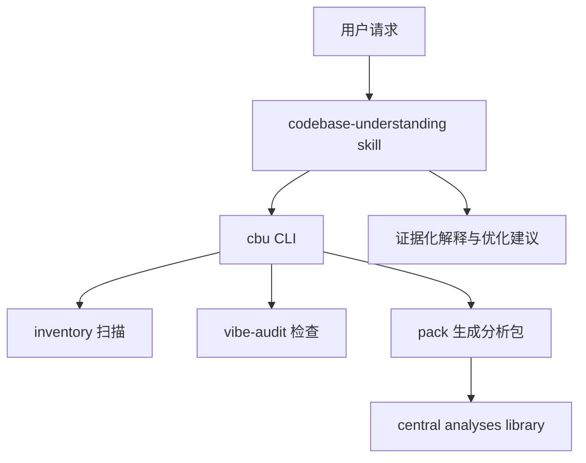
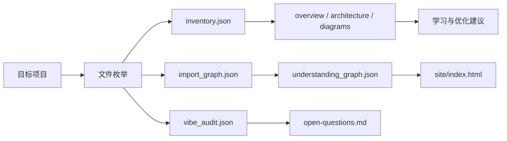

# Codebase Understanding ARCHITECTURE

## 1. Current Shape

当前工作区从中央分析库升级为源项目：

```text
/Users/chihoyo/Project/CodebaseUnderstanding/
  index.md
  docs/
    SPEC.md
    ARCHITECTURE.md
    ROADMAP.md
    DECISIONS.md
  src/codebase_understanding/
    cli.py
    import_graph.py
    inventory.py
    vibe_audit.py
    pack.py
    render_site.py
  skill/
    SKILL.md
    references/
      quick-learning-framework.md
  tests/
  analyses/
```

已安装 skill 仍位于：

```text
/Users/chihoyo/.codex/skills/codebase-understanding/
  SKILL.md
  scripts/inventory.py
  scripts/render_understanding_site.py
  references/output-contract.md
  references/diagram-recipes.md
```

本项目第一版不直接修改已安装 skill；`skill/` 是下一步可同步版本。

## 2. Layers



## 3. Module Responsibilities

| Module | Responsibility |
|---|---|
| `cli.py` | argparse command surface and user-facing command dispatch. |
| `import_graph.py` | File-level static import graph extraction for Python and JS/TS. |
| `inventory.py` | Deterministic project inventory: files, manifests, entrypoints, types, top directories. |
| `vibe_audit.py` | Heuristic checks for vibe-coded leftovers and missing verification signals. |
| `pack.py` | Output-root selection and Markdown/JSON analysis pack generation. |
| `render_site.py` | Static HTML renderer for `understanding_graph.json`; no external dependencies. |
| `skill/SKILL.md` | Agent workflow: decide mode, call CLI, explain confirmed facts vs inferences. |

## 3.1 Installed Commands

`scripts/install_cli.sh` installs two wrappers:

```text
/opt/homebrew/bin/cbu
/opt/homebrew/bin/codebase-understanding
```

The wrappers set `PYTHONPATH=/Users/chihoyo/Project/CodebaseUnderstanding/src` and execute `python3 -m codebase_understanding.cli`.

## 4. Data Flow



## 5. External Inputs

- Official Codex use cases: codebase onboarding, agent-friendly CLI, reusable skills.
- GitHub Copilot custom instruction guidance.
- Anthropic Claude Code best practices for exploration, planning, verification, and context management.
- 2026 arXiv studies on agent configuration and AGENTS.md context-file cost/benefit.

## 6. Confirmed Facts

- The existing installed skill already has `SKILL.md`, `agents/openai.yaml`, `scripts/inventory.py`, `scripts/render_understanding_site.py`, and two reference files.
- The current workspace was not a git repository during the initial inspection.
- `docdev` was not found on PATH during the initial inspection, so docs were created manually following the docs-driven contract.

## 7. Inferences

- Inference: keeping a source project under `/Users/chihoyo/Project/CodebaseUnderstanding` will make future sync, tests, and portability cleaner than editing only the installed skill directory.
- Inference: a standard-library Python CLI is the right first version because it can run in many vibe-coded project folders without dependency setup.
- Inference: file-level static import edges are strong enough for first-pass learning, but not enough to prove runtime call flow in framework-heavy apps.
