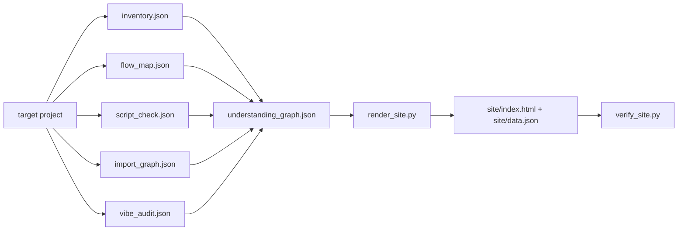

# ARCHITECTURE - interactive dashboard V1

> 本文件记录本次需求涉及的结构事实。它只描述当前实际结构和计划改动边界，不替代 SPEC 约束或 DECISIONS 取舍。

## 1. Current Data Flow



## 2. Planned V1 Data Shape

V1 keeps the existing graph top-level fields:

```text
title
summary
locale
nodes[]
edges[]
flows[]
evidence[]
questions[]
```

V1 adds optional node fields. Renderers must treat all of them as optional:

```text
meaning      # user-facing functional meaning
next_read    # recommended next reading step
signals[]    # evidence hints, path facts, project-kind facts
metrics{}    # incoming/outgoing import counts, file counts, flow counts
```

Rationale: this lets old graph JSON continue rendering while `visual-pack` can produce richer pages.

## 3. Renderer Boundary

`render_site.py` remains a no-build static HTML renderer:

- Input: `understanding_graph.json`.
- Output: `site/data.json` plus `site/index.html`.
- No network.
- No third-party JS/CSS.
- Browser interaction stays inline: search, click nodes, SVG graph, detail updates.

## 4. Code Touch Points

| File | Role in this change |
|---|---|
| `src/code_analyst/pack.py` | Generate richer graph nodes, metrics, signals, and reading guidance. |
| `src/code_analyst/render_site.py` | Display meaning, signals, next-read, and clickable relationships in detail panel. |
| `tests/test_pack.py` | Assert generated graph has V1 explanation fields. |
| `tests/test_render_site.py` | Assert rendered HTML supports V1 detail UI and remains backward compatible. |
| `tests/test_verify_site.py` | Existing readiness check should continue to pass. |

## 5. Non-Goals

- No target-local default output.
- No function/class-level parser.
- No Tree-sitter.
- No React/Vite.
- No semantic embeddings.
