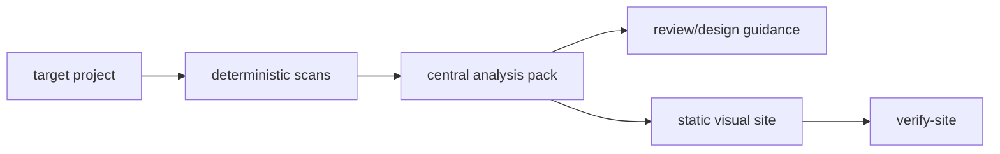
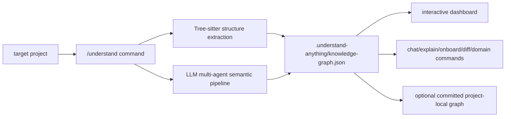

# ARCHITECTURE - understand-anything comparison

> 本文件记录本次调研涉及的结构事实。它只描述当前观察到的项目形态和影响，不替代 SPEC 约束或 DECISIONS 取舍。

## 1. Current CodeAnalyst Shape

CodeAnalyst 当前形态来自项目级 docs：

```text
skill/SKILL.md + references/
scripts/install_cli.sh / sync_skill.sh / install_remote.sh / package_release.sh
src/code_analyst/
  cli.py
  inventory.py
  flow_map.py
  script_check.py
  import_graph.py
  vibe_audit.py
  pack.py
  review_pack.py
  render_site.py
  verify_site.py
analyses/
```

核心数据流：



Key boundary: target project is read-only by default; persistent artifacts go to the central CodeAnalyst analyses library unless the user explicitly requests otherwise.

## 2. Understand Anything Observed Shape

Public evidence from GitHub/README/raw manifests shows this external shape:

```text
.claude-plugin/
.copilot-plugin/
.cursor-plugin/
install.sh / install.ps1
understand-anything-plugin/
  src/
    context-builder.ts
    diff-analyzer.ts
    explain-builder.ts
    onboard-builder.ts
    understand-chat.ts
  packages/
    core/
      src/
        analyzer/
        languages/
        persistence/
        schema.ts
        search.ts
        fingerprint.ts
        embedding-search.ts
    dashboard/
      src/
        App.tsx
        store.ts
        components/
        locales/
```

Observed runtime/product flow from README:



Key boundary: Understand Anything is intentionally target-local and shareable; README recommends committing graph artifacts except local scratch files.

## 3. Structural Differences

| Axis | CodeAnalyst | Understand Anything | Implication |
|---|---|---|---|
| Primary form | Python CLI-backed skill | TypeScript/pnpm multi-platform plugin monorepo | Forking changes language, tooling, release, and test surface. |
| Dependency policy | Python standard library first | Tree-sitter grammars, zod/yaml/fuse, React/Vite dashboard stack | Understand Anything can extract richer structure but costs more to install/package. |
| Output location | Central `analyses/` library by default | Target-local `.understand-anything/` graph | Direct adoption conflicts with CodeAnalyst read-only target invariant. |
| Output shape | Markdown + JSON evidence + static site | Knowledge graph JSON + rich interactive dashboard + follow-up commands | CodeAnalyst can borrow interaction concepts on top of existing evidence. |
| Agent model | Skill uses CLI evidence, agent interprets | Multi-agent pipeline generates graph, tours, domains, review | CodeAnalyst could add staged review/guided-tour generation without fully adopting orchestration. |
| Team sharing | Analysis library and exported artifacts | Commit graph to repo, post-commit auto-update | Useful idea, but should be an explicit export mode in CodeAnalyst. |
| Current direction | Review/refactor/design recommendations, no patches | Explore/search/ask/diff/domain/onboard dashboard experience | Complementary, not a drop-in replacement. |

## 4. Borrowable Architecture Ideas

1. Stable graph schema with richer node/edge types: file, function, class, dependency, layer, domain, tested_by, risk, recommendation.
2. Query layer over existing packs: fuzzy search first, semantic search later.
3. Chat/explain context builders that read `review_pack.json` and graph evidence, without rescanning target.
4. Guided learning tours ordered by dependency and entrypoint evidence.
5. Diff impact analysis using changed files against `import_graph.json`, `flow_map.json`, and review evidence.
6. Optional freshness/fingerprint metadata for repeated scans.
7. Optional target-local export/share mode that requires explicit user opt-in.

## 5. Integration Boundaries

- Keep CodeAnalyst source-of-truth docs and Python CLI as the main line.
- Do not change the default output root from the central analyses library.
- Do not introduce Tree-sitter or React dashboard into core without a separate decision and install smoke test.
- Treat Understand Anything as design reference and optional companion, not as the new CodeAnalyst base.
