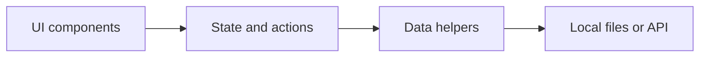
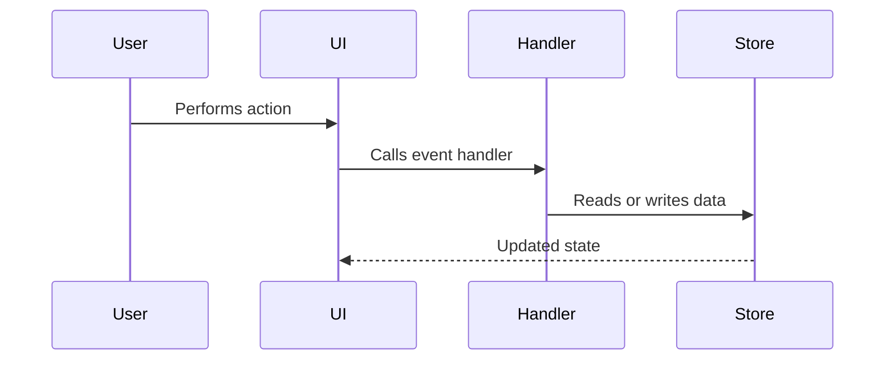
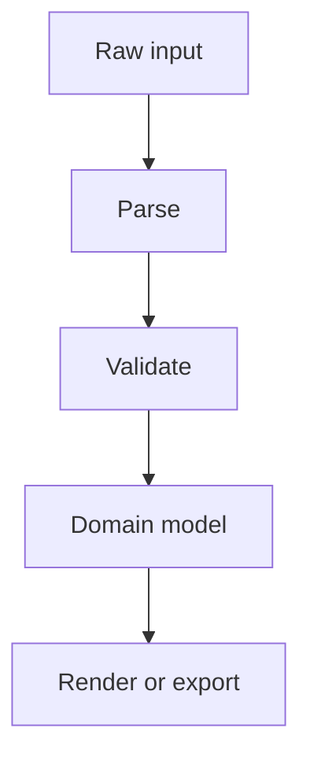
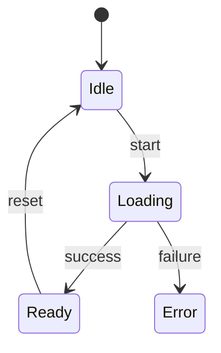

# Diagram Recipes

Use Mermaid diagrams for portable codebase explanations. Keep each diagram focused.

## Which Diagram To Use

- **Module map**: use `flowchart LR` for packages, folders, or major files.
- **Runtime flow**: use `sequenceDiagram` when events pass between UI, services, storage, and APIs.
- **Data transformation**: use `flowchart TD` when data changes shape through parsing, validation, enrichment, or rendering.
- **State lifecycle**: use `stateDiagram-v2` for tasks, jobs, auth states, import/export pipelines, or UI modes.
- **Page map**: use `flowchart TD` for frontend routes and screens.
- **Skill workflow**: use `flowchart TD` for trigger, inspect, helper scripts, fallback paths, and output artifacts.
- **Dependency/import graph**: use `flowchart LR` for confirmed import or package dependencies.
- **Artifact pipeline**: use `flowchart TD` when commands create files, manifests, caches, reports, or media outputs.
- **Evidence/risk map**: use `flowchart LR` to connect claims, files, unknowns, and likely dead or incomplete paths.

## Patterns

Module map:

Runtime flow:

Data flow:

State lifecycle:

## Diagram Quality Rules

- Use project terms from the code.
- Put file names in captions or evidence notes, not every node label.
- Avoid more than about 12 nodes in one diagram.
- If a diagram becomes dense, split it by feature or flow.
- Prefer verbs on edges: "calls", "reads", "writes", "renders", "emits", "validates".
- Mark inferred or suspected edges in the caption, not as confirmed structure.
- For Chinese requests, write captions and diagram labels in Chinese unless they are code identifiers or commands.
- For visual packs, mirror the important Mermaid concepts into `understanding_graph.json` with `group`, `layer`, and `kind` fields so the generated site can draw lanes and role colors.

## Visual Pack View Set

Pick the smallest useful set of views, usually 2-5:

- **Structure view**: entrypoints, core modules, scripts, data files, external systems.
- **Flow view**: what happens when the user runs the main command or performs the main UI action.
- **Dependency view**: imports, calls, plugin/skill boundaries, and external tool usage.
- **Artifact view**: input files, intermediate outputs, generated outputs, and cache/state ownership.
- **Risk view**: uncertain paths, fallbacks, likely unused code, and missing runtime checks.

## For Vibe-Coded Projects

Useful diagrams often include:

- "Actually wired path" vs "present but unused files"
- UI control to handler to state path
- Mock data replacement path
- Feature completeness map: working, partial, dead, unknown
